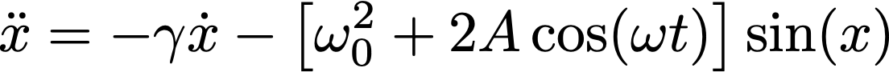

# Chaotic Pendulum

We consider the following differential equation
<p align="center">
  
</p>

This equation describes the motion of a pendulum subject to a damping force and a driving force.  Here `x` represents the angular position of the pendulum and dots are used to denote time derivatives.    

## Euler-Richardson

The program `euler_richardson_solver.c` solves the equation of motion using the Euler-Richardson numerical integration method.  In order to use it compile the code 
```
gcc euler_richardson_solver.c -o euler_richardson_solver.out 
```
Select values for the required inputs:
```
    x: float                /* angular position */
    v: float                /* angular speed */
    omega_0: float          /* natural frequency of pendulum */
    damping_constant: float /* pendulum damping constant */
    amplitude: float        /* pendulum driving force amplitude */
    omega: float            /* pendulum frequency */
    delta_t: float          /* time step for integration */
    t_max: float            /* maximum time for integration */
```
and run as
```
./euler_richardson_solver.out  0.1 0.0 1 0.2 0.85 2 0.01 1000
```
The above produces an orbit for the pendulum as displayed below
<p align="center">
  
</p>

Here `theta` is the angular position `x` converting to the range `[0, 2*pi)`.


## Poincare Map

We can generate with the program above the so-called Poincare map.  In the Poincare map we will display the values of `v` (the angular speed) and `theta` (the angular position) when the time variable is a multiple of the external driving force period.  For example for the following values
```
./euler_richardson_solver.out  0.1 0.0 1 0.2 1.05 2 0.0314159265 500000 
```
we obtain the Poincare map displayed below
<p align="center">
  
</p>